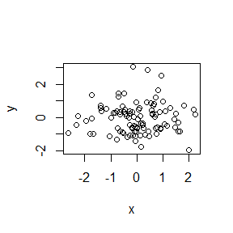

cmOO4
================

Level 1 header
==============

This is my level 2 header
-------------------------

this is a line of text -bullet 1 -bullet 2

``` r
x<-rnorm(100)
y<-rnorm(100)
plot(x,y)
```



``` r
summary(x)
```

    ##     Min.  1st Qu.   Median     Mean  3rd Qu.     Max. 
    ## -2.62316 -0.54004 -0.02028  0.01858  0.70765  2.25565

``` r
x<-rnorm(100)
```
