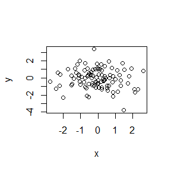

# cmOO4
# Level 1 header
## This is my header
this is a line of text
-bullet 1
-bullet 2


```r
x<-rnorm(100)
y<-rnorm(100)
plot(x,y)
```

<!-- -->

```r
summary(x)
```

```
##     Min.  1st Qu.   Median     Mean  3rd Qu.     Max. 
## -2.73013 -0.72570 -0.04914 -0.06565  0.57284  2.59550
```

```r
x<-rnorm(100)
```

